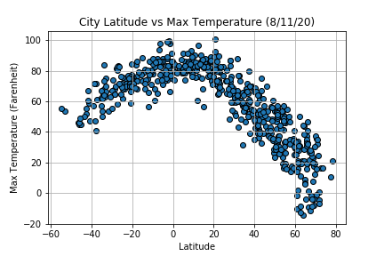
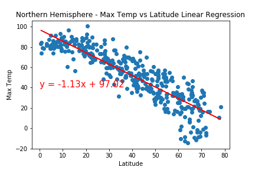
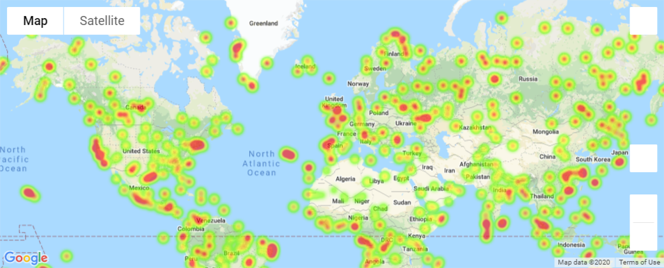

 <h2 align="center"> Python API Challenge </h2>
 <h1 align="center"> What's the Weather Like? </h1>

<!-- TABLE OF CONTENTS -->

  
Table of Contents

  <ol>
    <li>
      <a href="#background">Background</a>
      <ul>
        <li><a href="#built-with">Built With</a></li>
      </ul>
    </li>
    <li>
      <a href="#part-one">Part One</a>
      <ul>
        <li><a href="#python-notebook">Python Notebook</a></li>
        <li><a href="#scatter-plots">Scatter Plots</a></li>
        <li><a href="#linear-regression-plots">Linear Regression Plots</a></li>
        <li><a href="#dataframe">Dataframe</a></li>
      </ul>
    </li>
    <li>
      <a href="#part-two">Part Two</a>
      <ul>
        <li><a href="#python-notebook">Python Notebook</a></li>
        <li><a href="#heatmap">Heatmap</a></li>
        <li><a href="#hotel-map">Hotel Map</a></li>
      </ul>
    </li>
  </ol>

<!-- Background -->
## Background

Using Python requests, APIs, and JSON traversals, Part I of this project examines weather patterns as we approach the equator. While we intuitively know the temperature gets hotter, we will also evaluate humidity, windspeed, cloudiness, in addition to temperature, to understand how latitude affects weather. Part Two of this project will use jupyter-gmaps and the Google Places API to plan a future vacation based on the data collected in Part One. This python project was completed as a part of Georgia Tech's Data Science and Analytics boot camp.

### Built With
* [Python](https://www.python.org/)
* [CitiPy](https://pypi.python.org/pypi/citipy)
* [OpenWeatherMap API](https://openweathermap.org/api)

## Part One
### WeatherPy 

In order to visualize the weather of 500+ cities across the world of varying distance from the equator, we will utilize citipy, a [simple Python library](https://pypi.python.org/pypi/citipy) and the [OpenWeatherMap API](https://openweathermap.org/api) to help create a representative model of weather across world cities.

### Python Notebook
To view the python code used to extract and transform the data, select the link below to view the full notebook.
* [WeatherPy Jupyter Notebook](https://nbviewer.jupyter.org/github/asmvm/Python_API_Challenge/blob/master/Weather_Py/WeatherPy_main.ipynb)

### Scatter Plots
Scatter plots illustrating relationship between temperature, humidity, cloudiness, and windspeed vs latitude. Max Temp displayed below. Select links to plots to view remaining plots:

* [Humidity (%) vs. Latitude](saved_figures/lat_vs_humidity.png)
* [Cloudiness (%) vs. Latitude](saved_figures/lat_vs_cloudiness.png)
* [Wind Speed (mph) vs. Latitude](saved_figures/lat_vs_windspeed.png)

### Linear Regression Plots
Linear regression is run on each relationship, while also looking at cities in Northern Hemisphere (greater than or equal to 0 degrees latitude) and Southern Hemisphere (less than 0 degrees latitude). A linear regression function was created to optimize the code when creating the plots:

* [Southern Hemisphere - Temperature (F) vs. Latitude](saved_figures/southern_hem_maxtemp_vs_lat.png)
* [Northern Hemisphere - Humidity (%) vs. Latitude](saved_figures/northern_hem_humidity_vs_lat.png)
* [Southern Hemisphere - Humidity (%) vs. Latitude](saved_figures/southern_hem_humidity_vs_lat.png)
* [Northern Hemisphere - Cloudiness (%) vs. Latitude](saved_figures/northern_hem_cloudiness_vs_lat.png)
* [Southern Hemisphere - Cloudiness (%) vs. Latitude](saved_figures/southern_hem_cloudiness_vs_lat.png)
* [Northern Hemisphere - Wind Speed (mph) vs. Latitude](saved_figures/northern_hem_windspeed_vs_lat.png)
* [Southern Hemisphere - Wind Speed (mph) vs. Latitude](saved_figures/southern_hem_windspeed_vs_lat.png)

### Dataframe
The Pandas libray was utilized to create dataframes to hold weather data for 500+ cities and saved as a CSV file. 
* [Weather Data](Weather_Py/clean_city_data.csv)

## Part Two
### VacationPy

Based on the weather data, jupyter-gmaps and the Google Places API are used to plan future vacations. To view the jupyter notebook for VacationPy, select the link to read the python code. 
* [VacationPy Jupyter Notebook](https://nbviewer.jupyter.org/github/asmvm/Python_API_Challenge/blob/master/Vacation_Py/VacationPy_main.ipynb)

### Heatmap
We can generate a heatmap that displays the humidity for every city plotted in Part One. The humidity level is used as the weight for the heatmap.

* [cities heatmap full capture](saved_figures/heatmap_large_img_2021.PNG)

### Hotel Map
Narrowing down the DataFrame to find the ideal weather condition: 
* Locations are filtered for a max temperature lower than 80 degrees but higher than 70, wind speed less than 10 mph, and zero cloudiness.
* For the ideal vacation, all destinations must meet the three parameters.
* Using Google Places API to find the first hotel for each city located within 5000 meters of our coordinates.
* Hotels are plotted on top of the humidity heatmap with each pin containing the **Hotel Name**, **City**, and **Country**.

